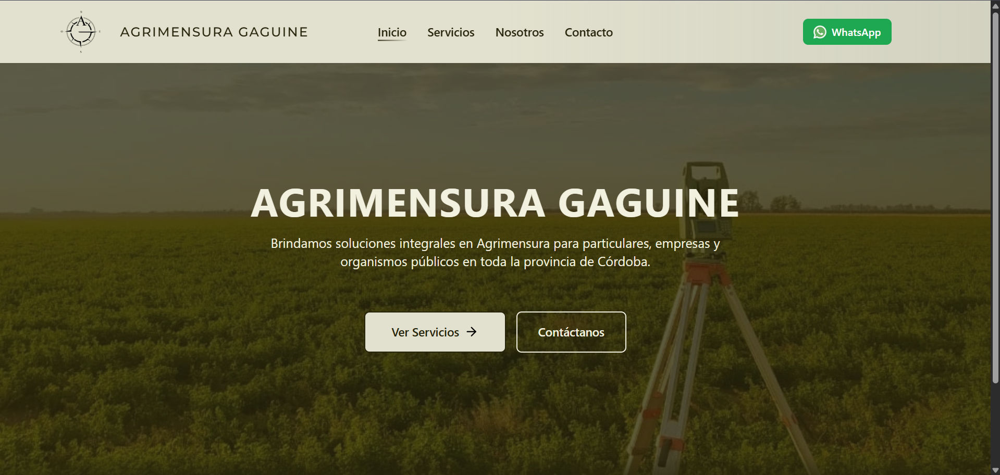
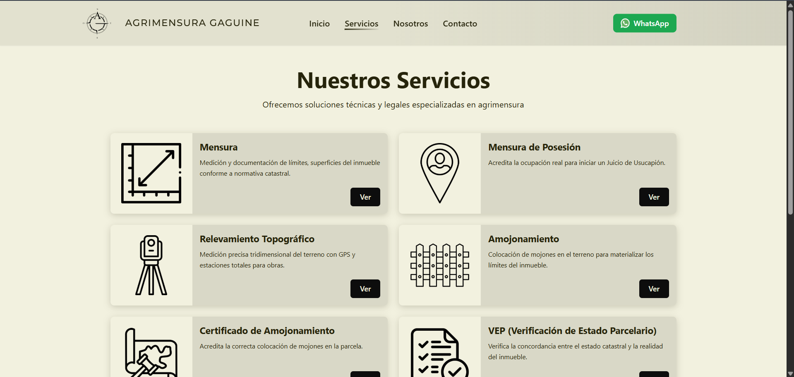
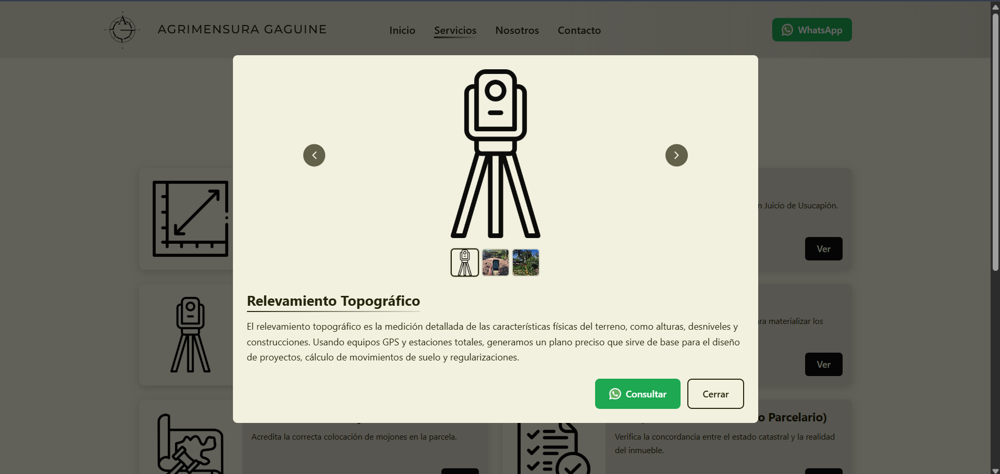
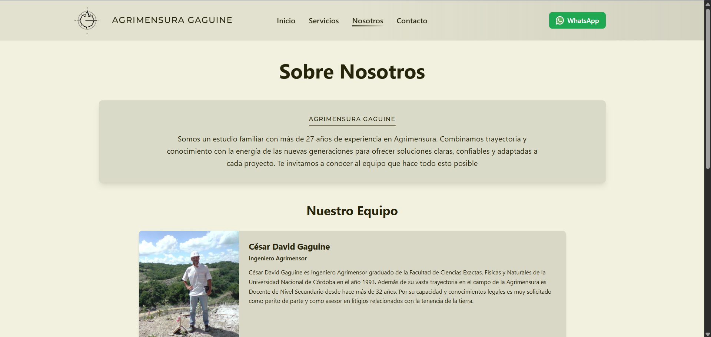
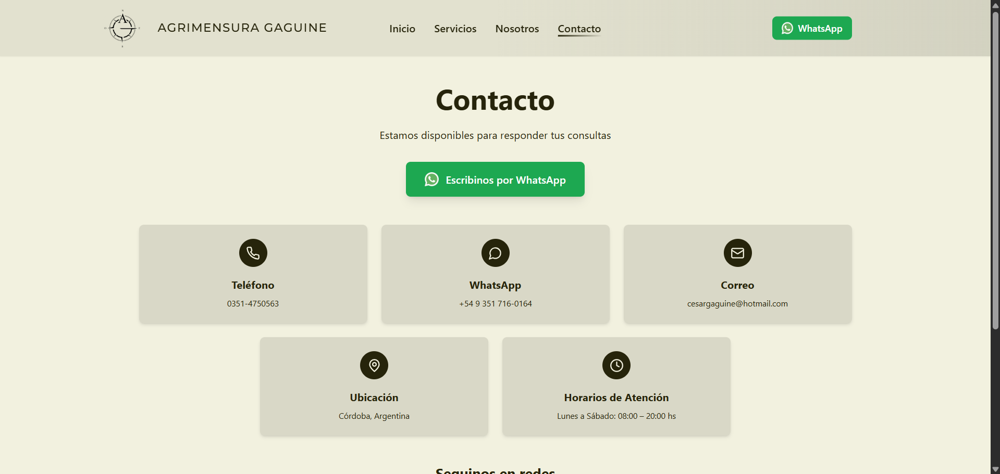

# Agrimensura Gaguine Web

Sitio web institucional de Agrimensura Gaguine, orientado a particulares, empresas y organismos publicos que necesitan informacion clara sobre servicios de agrimensura, equipo profesional y canales de contacto directos

## Demo

- URL desarrollo: https://agrimensuragaguine.netlify.app/
- URL producción (en proceso): https://www.agrimensuragaguine.com.ar/

## Capturas







## Tecnologias utilizadas

- React 18
- TypeScript 5
- Vite 5
- Tailwind CSS 3
- PostCSS + Autoprefixer
- React Router DOM 6
- Lucide React
- ESLint 9 + TypeScript ESLint
- Supabase JS (dependencia instalada en el proyecto)

## Funcionalidades

- Navegacion SPA con rutas para Inicio, Servicios, Nosotros y Contacto.
- Header sticky con menu responsive para mobile y desktop.
- Home con seccion hero y llamados a la accion hacia servicios y contacto.
- Catalogo de servicios con tarjetas interactivas y modal de detalle.
- Modal de servicios con carrusel de imagenes, miniaturas, teclado (flechas/Escape) y vista fullscreen.
- Integracion con WhatsApp en multiples puntos (header, boton flotante mobile, contacto y modal de servicio).
- Seccion de equipo renderizada desde datos tipados.
- Tarjetas de contacto y redes sociales con enlaces externos.
- Actualizacion dinamica del titulo del documento segun la pagina activa.

## Decisiones tecnicas

- Arquitectura por capas en frontend: `pages`, `components` y `data` para separar vistas, UI reutilizable y contenido.
- Enfoque data-driven para servicios y equipo, centralizando la informacion en archivos tipados.
- Router del lado cliente con mapeo de rutas y navegacion programatica para mantener una experiencia fluida.
- Tailwind CSS para consistencia visual y adaptacion responsive sin hojas de estilo extensas por componente.
- Vite + TypeScript para desarrollo rapido, tipado estatico y build optimizado.

## Instalacion

### Requisitos

- Node.js 18+
- npm 9+

### Pasos

```bash
npm install
npm run dev
```

La app quedara disponible en la URL local que indique Vite (normalmente `http://localhost:5173`).


## Estado del proyecto

Proyecto actualmente utilizado por la gente de **Agrimensura Gaguine** (@agrimensuragaguine), como medio de contacto con la marca e información de los servicios brindados

## Autor

- Nombre: Esteban Granja
- Rol: Desarrollador Frontend
- LinkedIn: linkedin.com/in/estebangranja/
- Email: tebygranja@gmail.com
